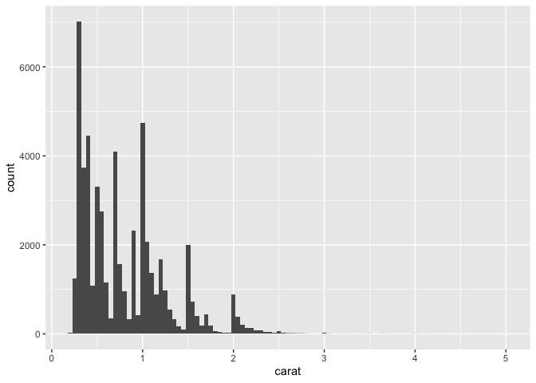
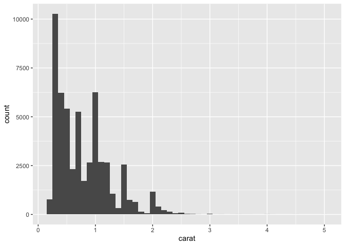
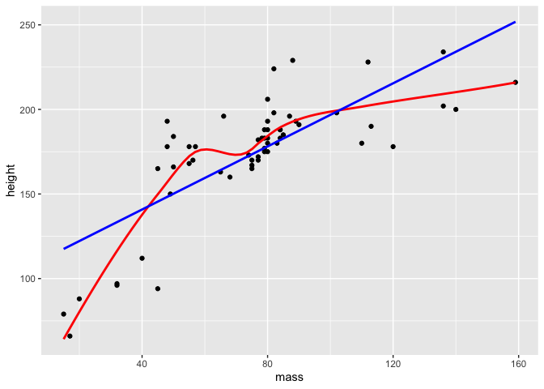
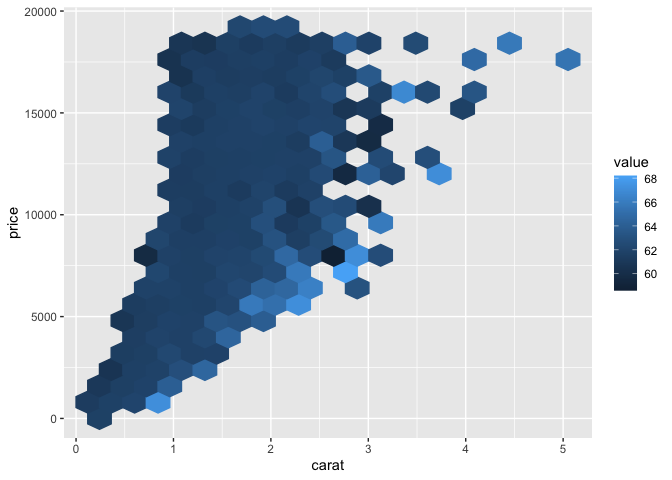
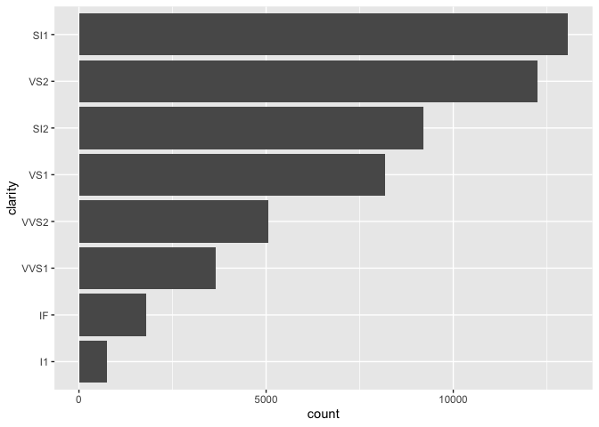

R Notebook
================

``` r
library(tidyverse)
```

    ── Attaching core tidyverse packages ──────────────────────── tidyverse 2.0.0 ──
    ✔ dplyr     1.1.2     ✔ readr     2.1.4
    ✔ forcats   1.0.0     ✔ stringr   1.5.0
    ✔ ggplot2   3.4.2     ✔ tibble    3.2.1
    ✔ lubridate 1.9.2     ✔ tidyr     1.3.0
    ✔ purrr     1.0.1     
    ── Conflicts ────────────────────────────────────────── tidyverse_conflicts() ──
    ✖ dplyr::filter() masks stats::filter()
    ✖ dplyr::lag()    masks stats::lag()
    ℹ Use the conflicted package (<http://conflicted.r-lib.org/>) to force all conflicts to become errors

``` r
library(nycflights13)
```

``` r
df <- tibble(
  a = rnorm(5),
  b = rnorm(5),
  c = rnorm(5),
  d = rnorm(5)
)
df
```

    # A tibble: 5 × 4
            a      b       c      d
        <dbl>  <dbl>   <dbl>  <dbl>
    1  1.79    0.442  1.08    0.766
    2 -0.0954 -0.434 -0.170  -2.01 
    3  1.10    0.548 -0.0926 -1.12 
    4 -1.47   -0.602  0.930  -0.927
    5  0.329  -0.360  0.962  -0.317

``` r
df |> mutate(
  a = (a - min(a, na.rm = TRUE)) / 
    (max(a, na.rm = TRUE) - min(a, na.rm = TRUE)),
  b = (b - min(b, na.rm = TRUE)) / 
    (max(b, na.rm = TRUE) - min(a, na.rm = TRUE)),
  c = (c - min(c, na.rm = TRUE)) / 
    (max(c, na.rm = TRUE) - min(c, na.rm = TRUE)),
  d = (d - min(d, na.rm = TRUE)) / 
    (max(d, na.rm = TRUE) - min(d, na.rm = TRUE)),
)
```

    # A tibble: 5 × 4
          a     b      c     d
      <dbl> <dbl>  <dbl> <dbl>
    1 1     1.90  1      1    
    2 0.421 0.306 0      0    
    3 0.787 2.10  0.0621 0.320
    4 0     0     0.880  0.389
    5 0.551 0.440 0.906  0.610

``` r
rescale01 <- function(x) {
  (x - min(x, na.rm = TRUE)) / (max(x, na.rm = TRUE) - min(x, na.rm = TRUE))
}
```

``` r
rescale01(c(-10, 0, 10))
```

    [1] 0.0 0.5 1.0

``` r
rescale01(c(1, 2, 3, NA, 5))
```

    [1] 0.00 0.25 0.50   NA 1.00

``` r
df |> mutate(
  a = rescale01(a),
  b = rescale01(b),
  c = rescale01(c),
  d = rescale01(d),
)
```

    # A tibble: 5 × 4
          a     b      c     d
      <dbl> <dbl>  <dbl> <dbl>
    1 1     0.908 1      1    
    2 0.421 0.146 0      0    
    3 0.787 1     0.0621 0.320
    4 0     0     0.880  0.389
    5 0.551 0.210 0.906  0.610

``` r
rescale01 <- function(x) {
  rng <- range(x, na.rm = TRUE, finite = TRUE)
  (x - rng[1]) / (rng[2] - rng[1])
}

x <- c(1:10, Inf)
rescale01(x)
```

     [1] 0.0000000 0.1111111 0.2222222 0.3333333 0.4444444 0.5555556 0.6666667
     [8] 0.7777778 0.8888889 1.0000000       Inf

``` r
z_score <- function(x) {
  (x - mean(x, na.rm = TRUE)) / sd(x, na.rm = TRUE)
}
```

``` r
clamp <- function(x, min, max) {
  case_when(
    x < min ~ min,
    x > max ~ max,
    .default = x
  )
}

clamp(1:10, min = 3, max = 7)
```

     [1] 3 3 3 4 5 6 7 7 7 7

``` r
first_upper <- function(x) {
  str_sub(x, 1, 1) <- str_to_upper(str_sub(x, 1, 1))
  x
}

first_upper(c("hello", "this", "is"))
```

    [1] "Hello" "This"  "Is"   

``` r
clean_number <- function(x) {
  is_pct <- str_detect(x, "%")
  num <- x |> 
    str_remove_all("%") |> 
    str_remove_all(",") |> 
    str_remove_all(fixed("$")) |> 
    as.numeric(x)
  if_else(is_pct, num / 100, num)
}

clean_number("$12,300")
```

    [1] 12300

``` r
clean_number("$45%")
```

    [1] 0.45

``` r
commas <- function(x) {
  str_flatten(x, collapse = ", ", last = " and ")
}

commas(c("cat", "dog", "pigeon"))
```

    [1] "cat, dog and pigeon"

``` r
cv <- function(x, na.rm = FALSE) {
  sd(x, na.rm = na.rm) / mean(x, na.rm = na.rm)
}

cv(runif(100, min = 0, max = 50))
```

    [1] 0.6457816

``` r
cv(runif(100, min = 0, max = 500))
```

    [1] 0.587906

``` r
grouped_mean <- function(df, group_var, mean_var) {
  df |> 
    group_by(group_var) |> 
    summarize(mean(mean_var))
}

try(diamonds |> grouped_mean(cut, carat))
```

    Error in group_by(df, group_var) : 
      Must group by variables found in `.data`.
    ✖ Column `group_var` is not found.

``` r
df <- tibble(
  mean_var = 1,
  group_var = "g",
  group = 1,
  x = 10,
  y = 100
)
df
```

    # A tibble: 1 × 5
      mean_var group_var group     x     y
         <dbl> <chr>     <dbl> <dbl> <dbl>
    1        1 g             1    10   100

``` r
df |> grouped_mean(group, x)
```

    # A tibble: 1 × 2
      group_var `mean(mean_var)`
      <chr>                <dbl>
    1 g                        1

``` r
df |> grouped_mean(group, y)
```

    # A tibble: 1 × 2
      group_var `mean(mean_var)`
      <chr>                <dbl>
    1 g                        1

``` r
grouped_mean <- function(df, group_var, mean_var) {
  df |> 
    group_by({{ group_var }}) |> 
    summarize(mean({{ mean_var }}))
}

df |> grouped_mean(group, x)
```

    # A tibble: 1 × 2
      group `mean(x)`
      <dbl>     <dbl>
    1     1        10

``` r
summary6 <- function(data, var) {
  data |> summarize(
    min = min({{ var }}, na.rm = TRUE),
    mean = mean({{ var }}, na.rm = TRUE),
    median = median({{ var }}, na.rm = TRUE),
    max = max({{ var }}, na.rm = TRUE),
    n = n(),
    n_miss = sum(is.na({{ var }})),
    .groups = "drop"
  )
}

diamonds |> summary6(carat)
```

    # A tibble: 1 × 6
        min  mean median   max     n n_miss
      <dbl> <dbl>  <dbl> <dbl> <int>  <int>
    1   0.2 0.798    0.7  5.01 53940      0

``` r
diamonds |> 
  group_by(cut) |> 
  summary6(carat)
```

    # A tibble: 5 × 7
      cut         min  mean median   max     n n_miss
      <ord>     <dbl> <dbl>  <dbl> <dbl> <int>  <int>
    1 Fair       0.22 1.05    1     5.01  1610      0
    2 Good       0.23 0.849   0.82  3.01  4906      0
    3 Very Good  0.2  0.806   0.71  4    12082      0
    4 Premium    0.2  0.892   0.86  4.01 13791      0
    5 Ideal      0.2  0.703   0.54  3.5  21551      0

``` r
diamonds |> 
  group_by(cut) |> 
  summary6(log10(carat))
```

    # A tibble: 5 × 7
      cut          min    mean  median   max     n n_miss
      <ord>      <dbl>   <dbl>   <dbl> <dbl> <int>  <int>
    1 Fair      -0.658 -0.0273  0      0.700  1610      0
    2 Good      -0.638 -0.133  -0.0862 0.479  4906      0
    3 Very Good -0.699 -0.164  -0.149  0.602 12082      0
    4 Premium   -0.699 -0.125  -0.0655 0.603 13791      0
    5 Ideal     -0.699 -0.225  -0.268  0.544 21551      0

``` r
# https://twitter.com/Diabb6/status/1571635146658402309
count_prop <- function(df, var, sort = FALSE) {
  df |>
    count({{ var }}, sort = sort) |>
    mutate(prop = n / sum(n))
}

diamonds |> count_prop(clarity)
```

    # A tibble: 8 × 3
      clarity     n   prop
      <ord>   <int>  <dbl>
    1 I1        741 0.0137
    2 SI2      9194 0.170 
    3 SI1     13065 0.242 
    4 VS2     12258 0.227 
    5 VS1      8171 0.151 
    6 VVS2     5066 0.0939
    7 VVS1     3655 0.0678
    8 IF       1790 0.0332

``` r
unique_where <- function(df, condition, var) {
  df |> 
    filter({{ condition }}) |> 
    distinct({{ var }}) |> 
    arrange({{ var }})
}

# Find all the destinations in December
flights |> unique_where(month == 12, dest)
```

    # A tibble: 96 × 1
       dest 
       <chr>
     1 ABQ  
     2 ALB  
     3 ATL  
     4 AUS  
     5 AVL  
     6 BDL  
     7 BGR  
     8 BHM  
     9 BNA  
    10 BOS  
    # ℹ 86 more rows

``` r
count_missing <- function(df, group_vars, x_var) {
  df |> 
    group_by(pick({{ group_vars }})) |> 
    summarize(
      n_miss = sum(is.na({{ x_var }})),
      .groups = "drop"
    )
}

flights |> 
  count_missing(c(year, month, day), dep_time)
```

    # A tibble: 365 × 4
        year month   day n_miss
       <int> <int> <int>  <int>
     1  2013     1     1      4
     2  2013     1     2      8
     3  2013     1     3     10
     4  2013     1     4      6
     5  2013     1     5      3
     6  2013     1     6      1
     7  2013     1     7      3
     8  2013     1     8      4
     9  2013     1     9      5
    10  2013     1    10      3
    # ℹ 355 more rows

``` r
count_wide <- function(data, rows, cols) {
  data |> 
    count(pick(c({{ rows }}, {{ cols }}))) |> 
    pivot_wider(
      names_from = {{ cols }},
      values_from = n,
      names_sort = TRUE,
      values_fill = 0
    )
}

diamonds |> count_wide(c(clarity, color), cut)
```

    # A tibble: 56 × 7
       clarity color  Fair  Good `Very Good` Premium Ideal
       <ord>   <ord> <int> <int>       <int>   <int> <int>
     1 I1      D         4     8           5      12    13
     2 I1      E         9    23          22      30    18
     3 I1      F        35    19          13      34    42
     4 I1      G        53    19          16      46    16
     5 I1      H        52    14          12      46    38
     6 I1      I        34     9           8      24    17
     7 I1      J        23     4           8      13     2
     8 SI2     D        56   223         314     421   356
     9 SI2     E        78   202         445     519   469
    10 SI2     F        89   201         343     523   453
    # ℹ 46 more rows

``` r
diamonds |> 
  ggplot(aes(x = carat)) +
  geom_histogram(binwidth = 0.1)
```


``` r
diamonds |> 
  ggplot(aes(x = carat)) +
  geom_histogram(binwidth = 0.05)
```



``` r
histogram <- function(df, var, binwidth = NULL) {
  df |> 
    ggplot(aes(x = {{ var }})) + 
    geom_histogram(binwidth = binwidth)
}

diamonds |> histogram(carat, 0.1)
```



``` r
diamonds |> 
  histogram(carat, 0.1) +
  labs(x = "Size (in carats)", y = "Number of diamonds")
```


``` r
linearity_check <- function(df, x, y) {
  df |> 
    ggplot(aes(x = {{ x }}, y = {{ y }})) +
    geom_point() +
    geom_smooth(method = "loess", formula = y ~ x, color = "red", se = FALSE) +
    geom_smooth(method = "lm", formula = y ~ x, color = "blue", se = FALSE) 
}

starwars |> 
  filter(mass < 1000) |> 
  linearity_check(mass, height)
```



``` r
diamonds |> 
  ggplot(aes(x = carat, y = price, z = depth)) +
  stat_summary_hex(
    aes(color = after_scale(fill)),
    bins = 20,
    fun = mean
  )
```



``` r
# https://twitter.com/ppaxisa/status/1574398423175921665
hex_plot <- function(df, x, y, z, bins = 20, fun = "mean") {
  df |> 
    ggplot(aes(x = {{ x }}, y = {{ y }}, z = {{ z }})) + 
    stat_summary_hex(
      aes(color = after_scale(fill)), # make border same color as fill
      bins = bins, 
      fun = fun,
    )
}

diamonds |> hex_plot(carat, price, depth)
```


``` r
diamonds |> 
  mutate(clarity = fct_rev(fct_infreq(clarity))) |> 
  ggplot(aes(y = clarity)) +
  geom_bar()
```



``` r
sorted_bars <- function(df, var) {
  df |> 
    mutate({{ var }} := fct_rev(fct_infreq({{ var }})))  |>
    ggplot(aes(y = {{ var }})) +
    geom_bar()
}

diamonds |> sorted_bars(clarity)
```


